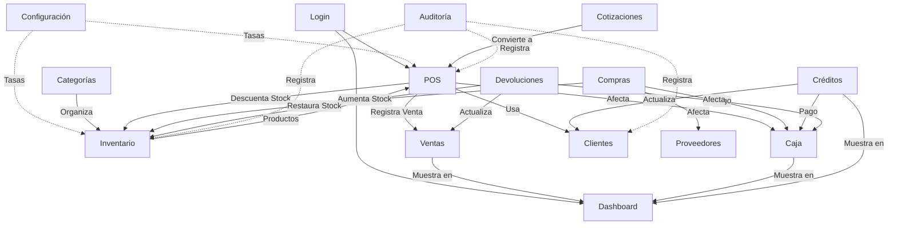

# 🔍 Guía Completa de Pruebas del Sistema POS
## Auditoría de Interdependencias y Casos de Prueba

**Fecha:** 19 de Diciembre, 2025  
**Sistema:** Ferretería POS - Sistema Integral de Punto de Venta  
**Versión:** 2.0

---

## 📊 Resumen Ejecutivo

Este documento describe **cómo probar cada módulo del sistema** y **qué efectos secundarios esperar** en otros módulos. Cada acción en el sistema tiene un efecto en cascada que debe ser verificado.

### Módulos del Sistema

| # | Módulo | Descripción | Módulos Afectados |
|---|--------|-------------|-------------------|
| 1 | **Login/Usuarios** | Autenticación y gestión de usuarios | Auditoría |
| 2 | **Dashboard** | Panel de control financiero | Todos (lectura) |
| 3 | **POS** | Punto de venta | Inventario, Caja, Ventas, Clientes |
| 4 | **Inventario** | Gestión de productos | POS, Ventas, Compras |
| 5 | **Categorías** | Organización de productos | Inventario, POS |
| 6 | **Proveedores** | Gestión de proveedores | Compras |
| 7 | **Compras** | Órdenes de compra | Inventario, Proveedores, Caja |
| 8 | **Clientes** | Gestión de clientes | POS, Ventas, Créditos |
| 9 | **Caja** | Sesiones de caja | POS, Ventas, Dashboard |
| 10 | **Ventas** | Historial de ventas | Dashboard, Inventario, Caja |
| 11 | **Créditos** | Cuentas por cobrar | Clientes, Caja, Dashboard |
| 12 | **Devoluciones** | Devoluciones de ventas | Inventario, Caja, Ventas |
| 13 | **Cotizaciones** | Cotizaciones a clientes | Clientes, POS |
| 14 | **Configuración** | Tasas de cambio, monedas | Todos |
| 15 | **Auditoría** | Registro de cambios | Todos (lectura) |

---

## 🗺️ Mapa de Interdependencias



---

## 📝 Casos de Prueba por Módulo

### 1️⃣ MÓDULO: Inventario (Productos)

#### 🎯 Objetivo
Verificar que la gestión de productos funciona correctamente y afecta a los módulos dependientes.

#### 📦 Caso de Prueba 1.1: Crear Producto Simple

**Pasos:**
1. Ir a **Inventario** → **Productos**
2. Click en **"Nuevo Producto"**
3. Llenar formulario:
   - **General:**
     - Nombre: "Cemento Gris 50kg"
     - SKU: "CEM-001"
     - Categoría: "Construcción"
   - **Precios & Stock:**
     - Costo: $5.00
     - Precio: $10.00
     - Stock: 100
     - Stock Mínimo: 10
4. Guardar

**Resultados Esperados:**

| Módulo | Efecto Esperado | Cómo Verificar |
|--------|----------------|----------------|
| **Inventario** | Producto aparece en la lista | Buscar "Cemento" en lista de productos |
| **POS** | Producto disponible para venta | Buscar "Cemento" en POS, debe aparecer |
| **Dashboard** | No afecta (aún no hay ventas) | - |
| **Auditoría** | Registro de creación | Ver logs: "CREATE products" |

---

#### 📦 Caso de Prueba 1.2: Crear Producto con Presentaciones

**Pasos:**
1. Crear producto "Tornillo 1/4"
2. **General:**
   - Nombre: "Tornillo 1/4 pulgada"
   - SKU: "TOR-001"
3. **Precios & Stock:**
   - Costo: $0.10
   - Precio: $0.20
   - Stock: 10,000 (unidades sueltas)
4. **Presentaciones:** Agregar 3 unidades:
   
   **Presentación 1: Caja**
   - Nombre: "Caja"
   - Factor: 100 (100 tornillos por caja)
   - Precio: $18.00 (descuento por volumen)
   - Código de barras: "7890123456789"
   
   **Presentación 2: Paquete**
   - Nombre: "Paquete"
   - Factor: 12 (12 tornillos por paquete)
   - Precio: $2.00
   
   **Presentación 3: Kilogramo**
   - Nombre: "Kilogramo"
   - Factor: 0.001 (1000 tornillos = 1 kg)
   - Precio: $180.00

5. Guardar

**Resultados Esperados:**

| Módulo | Efecto Esperado | Cómo Verificar |
|--------|----------------|----------------|
| **Inventario** | Producto muestra "+ 3 Presentaciones" | Ver badge naranja en lista |
| **POS** | Al hacer click, abre modal de selección | Click en "Tornillo", debe mostrar 4 opciones: Unidad, Caja, Paquete, Kilogramo |
| **POS** | Agregar "Caja" descuenta 100 unidades | Vender 1 caja, verificar stock baja a 9,900 |
| **POS** | Precio correcto por presentación | Caja = $18.00, Paquete = $2.00, Kg = $180.00 |
| **Ventas** | Registro muestra presentación vendida | Historial debe decir "Tornillo - Caja (x100)" |

---

#### 📦 Caso de Prueba 1.3: Producto con Tasa de Cambio Específica

**Pasos:**
1. Crear producto "Cable Eléctrico"
2. **Precios & Stock:**
   - Precio: $10.00
3. **Perfil de Tasa de Cambio:**
   - Seleccionar "Tasa COP" (si existe)
4. Guardar

**Resultados Esperados:**

| Módulo | Efecto Esperado | Cómo Verificar |
|--------|----------------|----------------|
| **POS** | Muestra precio en COP con tasa específica | Agregar al carrito, ver total COP |
| **POS** | Badge morado indica tasa especial | Ver icono 💱 y nombre de tasa |
| **Ventas** | Registro guarda tasa usada | Ver detalle de venta |

---

#### 📦 Caso de Prueba 1.4: Editar Stock de Producto

**Pasos:**
1. Editar "Cemento Gris 50kg"
2. Cambiar stock de 100 a 50
3. Guardar

**Resultados Esperados:**

| Módulo | Efecto Esperado | Cómo Verificar |
|--------|----------------|----------------|
| **Inventario** | Stock actualizado | Ver lista, debe mostrar 50 |
| **POS** | Stock actualizado en tiempo real | Ver badge de stock en POS |
| **Dashboard** | No afecta valorización | - |
| **Auditoría** | Registro de cambio | Ver logs: "UPDATE products, stock: 100 → 50" |

---

### 2️⃣ MÓDULO: POS (Punto de Venta)

#### 🎯 Objetivo
Verificar que las ventas afectan correctamente a Inventario, Caja, Ventas y Dashboard.

#### 🛒 Caso de Prueba 2.1: Venta Simple en Efectivo

**Pasos:**
1. Abrir caja con $100 USD y 4,500 Bs
2. Ir a **POS**
3. Buscar "Cemento" (F3)
4. Agregar al carrito (Enter)
5. Verificar totales:
   - USD: $10.00
   - Bs: 450.00 (si tasa es 45)
   - COP: 45,000 (si tasa es 4,500)
6. Cobrar (F5)
7. Método: Efectivo USD
8. Monto: $10.00
9. Confirmar venta

**Resultados Esperados:**

| Módulo | Efecto Esperado | Cómo Verificar |
|--------|----------------|----------------|
| **Inventario** | Stock de Cemento: 100 → 99 | Ver producto en inventario |
| **Caja** | Efectivo USD: $100 → $110 | Ver sesión de caja actual |
| **Ventas** | Nueva venta registrada | Historial de ventas, última venta = $10.00 |
| **Dashboard** | Total ventas USD +$10.00 | Dashboard muestra venta del día |
| **Dashboard** | Ganancia estimada +$5.00 | (Precio $10 - Costo $5) |
| **POS** | Carrito limpiado | Carrito vacío después de venta |
| **POS** | Modal de éxito | Muestra "Venta exitosa" |

---

#### 🛒 Caso de Prueba 2.2: Venta con Presentaciones

**Pasos:**
1. Buscar "Tornillo"
2. Click en producto
3. **Verificar:** Modal muestra 4 opciones
4. Seleccionar "Caja (100 unidades)"
5. Verificar precio: $18.00
6. Agregar al carrito
7. Cobrar en efectivo

**Resultados Esperados:**

| Módulo | Efecto Esperado | Cómo Verificar |
|--------|----------------|----------------|
| **Inventario** | Stock: 10,000 → 9,900 | Descuenta 100 unidades |
| **Ventas** | Detalle: "Tornillo - Caja (x100)" | Ver historial |
| **Caja** | Efectivo +$18.00 | Ver sesión |
| **Dashboard** | Venta +$18.00 | Ver dashboard |

---

#### 🛒 Caso de Prueba 2.3: Venta Multi-Moneda

**Pasos:**
1. Agregar productos por $50.00
2. Cobrar con:
   - $30.00 en USD
   - 900 Bs (equivalente a $20.00 si tasa es 45)
3. Confirmar

**Resultados Esperados:**

| Módulo | Efecto Esperado | Cómo Verificar |
|--------|----------------|----------------|
| **Caja** | Efectivo USD: +$30.00 | Ver sesión |
| **Caja** | Efectivo Bs: +900 Bs | Ver sesión |
| **Ventas** | 2 registros de pago | Ver detalle de venta |
| **Dashboard** | Ventas USD: +$30.00 | Ver tarjeta USD |
| **Dashboard** | Ventas Bs: +900 Bs | Ver tarjeta Bs |

---

#### 🛒 Caso de Prueba 2.4: Venta a Crédito

**Pasos:**
1. Agregar productos por $100.00
2. Cobrar
3. Seleccionar cliente: "Juan Pérez"
4. Marcar "Venta a Crédito"
5. Días de crédito: 30
6. Confirmar

**Resultados Esperados:**

| Módulo | Efecto Esperado | Cómo Verificar |
|--------|----------------|----------------|
| **Inventario** | Stock descontado | Productos vendidos bajan stock |
| **Caja** | No afecta efectivo | Caja no aumenta (es crédito) |
| **Ventas** | Venta marcada como crédito | `is_credit: true` |
| **Clientes** | Deuda aumenta $100.00 | Ver estado financiero del cliente |
| **Créditos** | Aparece en cuentas por cobrar | Ver módulo de créditos |
| **Dashboard** | No suma a "efectivo recaudado" | Solo suma a "ventas totales" |

---

### 3️⃣ MÓDULO: Caja (Cash Register)

#### 🎯 Objetivo
Verificar que las sesiones de caja registran correctamente todos los movimientos.

#### 💰 Caso de Prueba 3.1: Abrir Caja

**Pasos:**
1. Ir a **POS** (si caja está cerrada)
2. Modal de apertura aparece
3. Ingresar:
   - USD: $100.00
   - Bs: 4,500.00
   - COP: 450,000.00
4. Abrir turno

**Resultados Esperados:**

| Módulo | Efecto Esperado | Cómo Verificar |
|--------|----------------|----------------|
| **Caja** | Sesión activa creada | Ver "Cerrar Caja" habilitado |
| **POS** | POS habilitado | Puede hacer ventas |
| **Auditoría** | Registro de apertura | Ver logs |

---

#### 💰 Caso de Prueba 3.2: Registrar Gasto

**Pasos:**
1. En POS, click "Gasto/Retiro"
2. Tipo: GASTO
3. Monto: $20.00
4. Moneda: USD
5. Descripción: "Compra de papelería"
6. Guardar

**Resultados Esperados:**

| Módulo | Efecto Esperado | Cómo Verificar |
|--------|----------------|----------------|
| **Caja** | Efectivo USD: $100 → $80 | Ver sesión actual |
| **Caja** | Movimiento registrado | Ver lista de movimientos |
| **Dashboard** | Gastos del día +$20.00 | Ver flujo de efectivo |

---

#### 💰 Caso de Prueba 3.3: Cerrar Caja

**Pasos:**
1. Hacer 3 ventas:
   - Venta 1: $10 efectivo USD
   - Venta 2: $20 efectivo Bs (900 Bs)
   - Venta 3: $30 transferencia USD
2. Registrar gasto: $5 USD
3. Ir a **Cerrar Caja**
4. Contar efectivo:
   - USD: $105.00 (esperado: $100 + $10 - $5 = $105)
   - Bs: 5,400 (esperado: 4,500 + 900 = 5,400)
5. Cerrar

**Resultados Esperados:**

| Módulo | Efecto Esperado | Cómo Verificar |
|--------|----------------|----------------|
| **Caja** | Sesión cerrada | Estado: "CLOSED" |
| **Caja** | Diferencia: $0.00 | Reportado = Esperado |
| **Caja** | Resumen correcto | Ventas: $60, Gastos: $5, Esperado: $105 USD |
| **Dashboard** | Métricas actualizadas | Ver ventas del día |
| **Historial Caja** | Sesión aparece | Ver historial de caja |

---

### 4️⃣ MÓDULO: Clientes

#### 🎯 Objetivo
Verificar gestión de clientes y su integración con ventas y créditos.

#### 👤 Caso de Prueba 4.1: Crear Cliente

**Pasos:**
1. Ir a **Clientes**
2. Nuevo Cliente
3. Datos:
   - Nombre: "Constructora ABC"
   - RIF: "J-12345678"
   - Teléfono: "0412-1234567"
   - Límite de crédito: $1,000.00
   - Días de crédito: 30
4. Guardar

**Resultados Esperados:**

| Módulo | Efecto Esperado | Cómo Verificar |
|--------|----------------|----------------|
| **Clientes** | Cliente en lista | Buscar "Constructora ABC" |
| **POS** | Disponible en selector | Al hacer venta a crédito |
| **Créditos** | Sin deuda inicial | Balance: $0.00 |

---

#### 👤 Caso de Prueba 4.2: Venta a Cliente con Crédito

**Pasos:**
1. Hacer venta de $500.00
2. Cliente: "Constructora ABC"
3. Marcar como crédito
4. Confirmar

**Resultados Esperados:**

| Módulo | Efecto Esperado | Cómo Verificar |
|--------|----------------|----------------|
| **Clientes** | Deuda actual: $500.00 | Ver estado financiero |
| **Clientes** | Crédito disponible: $500.00 | ($1,000 límite - $500 usado) |
| **Créditos** | Factura pendiente | Ver cuentas por cobrar |
| **Dashboard** | Créditos pendientes +$500 | Ver métricas |

---

#### 👤 Caso de Prueba 4.3: Pagar Crédito

**Pasos:**
1. Ir a **Cuentas por Cobrar**
2. Buscar factura de "Constructora ABC"
3. Registrar pago:
   - Monto: $200.00
   - Moneda: USD
   - Método: Transferencia
4. Guardar

**Resultados Esperados:**

| Módulo | Efecto Esperado | Cómo Verificar |
|--------|----------------|----------------|
| **Clientes** | Deuda: $500 → $300 | Ver estado financiero |
| **Clientes** | Crédito disponible: $700 | ($1,000 - $300) |
| **Créditos** | Balance pendiente: $300 | Ver factura |
| **Caja** | Transferencia USD +$200 | Ver sesión actual |
| **Dashboard** | Créditos cobrados +$200 | Ver flujo de efectivo |

---

### 5️⃣ MÓDULO: Compras (Órdenes de Compra)

#### 🎯 Objetivo
Verificar que las compras afectan inventario y proveedores.

#### 📦 Caso de Prueba 5.1: Compra al Contado

**Pasos:**
1. Ir a **Compras**
2. Nueva Orden
3. Proveedor: "Distribuidora XYZ"
4. Agregar productos:
   - Cemento: 50 unidades a $4.50 c/u
   - Tornillos: 1,000 unidades a $0.08 c/u
5. Total: $305.00
6. Tipo de pago: CONTADO
7. Confirmar

**Resultados Esperados:**

| Módulo | Efecto Esperado | Cómo Verificar |
|--------|----------------|----------------|
| **Inventario** | Stock Cemento: +50 | Ver producto |
| **Inventario** | Stock Tornillos: +1,000 | Ver producto |
| **Inventario** | Costo actualizado (si marcado) | Cemento costo = $4.50 |
| **Proveedores** | Sin deuda | Pago al contado |
| **Caja** | Efectivo -$305.00 | Ver sesión |
| **Compras** | Orden en historial | Estado: "PAGADO" |

---

#### 📦 Caso de Prueba 5.2: Compra a Crédito

**Pasos:**
1. Nueva orden a "Distribuidora XYZ"
2. Total: $500.00
3. Tipo: CRÉDITO
4. Confirmar

**Resultados Esperados:**

| Módulo | Efecto Esperado | Cómo Verificar |
|--------|----------------|----------------|
| **Inventario** | Stock aumentado | Ver productos |
| **Proveedores** | Deuda: +$500.00 | Ver proveedor |
| **Caja** | No afecta | Es crédito |
| **Compras** | Estado: "PENDIENTE" | Ver orden |

---

### 6️⃣ MÓDULO: Devoluciones

#### 🎯 Objetivo
Verificar que las devoluciones restauran stock y afectan caja.

#### 🔄 Caso de Prueba 6.1: Devolución Total

**Pasos:**
1. Hacer venta de 2 Cementos ($20.00)
2. Ir a **Devoluciones**
3. Buscar venta
4. Seleccionar todos los productos
5. Motivo: "Producto defectuoso"
6. Confirmar devolución

**Resultados Esperados:**

| Módulo | Efecto Esperado | Cómo Verificar |
|--------|----------------|----------------|
| **Inventario** | Stock Cemento: +2 | Restaura unidades |
| **Caja** | Efectivo -$20.00 | Reembolso |
| **Ventas** | Venta marcada como devuelta | Ver historial |
| **Dashboard** | Ventas netas -$20.00 | Resta de ventas |
| **Devoluciones** | Registro creado | Ver historial de devoluciones |

---

### 7️⃣ MÓDULO: Dashboard

#### 🎯 Objetivo
Verificar que todas las métricas se calculan correctamente.

#### 📊 Caso de Prueba 7.1: Métricas del Día

**Escenario:**
- Ventas: 3 ventas ($100 total)
- Gastos: 1 gasto ($20)
- Créditos: 1 venta a crédito ($50)
- Pagos de crédito: 1 pago ($30)

**Resultados Esperados:**

| Métrica | Valor Esperado | Cómo Verificar |
|---------|----------------|----------------|
| **Ventas USD** | $100.00 | Tarjeta "Ventas en USD" |
| **Efectivo Recaudado** | $50.00 | ($100 ventas - $50 crédito) |
| **Créditos Pendientes** | $20.00 | ($50 crédito - $30 pago) |
| **Ganancia Estimada** | Depende de costos | Ver tarjeta de ganancia |
| **Transacciones** | 4 | (3 ventas + 1 pago crédito) |

---

### 8️⃣ MÓDULO: Configuración (Multi-Moneda)

#### 🎯 Objetivo
Verificar que los cambios de tasas afectan todo el sistema.

#### ⚙️ Caso de Prueba 8.1: Cambiar Tasa de Cambio

**Pasos:**
1. Ir a **Configuración** → **Tasas de Cambio**
2. Editar "Tasa BCV"
3. Cambiar de 45.00 a 50.00 Bs/USD
4. Guardar

**Resultados Esperados:**

| Módulo | Efecto Esperado | Cómo Verificar |
|--------|----------------|----------------|
| **POS** | Totales recalculados | $10 = 500 Bs (antes 450) |
| **Inventario** | Precios convertidos actualizados | Ver vista previa de precios |
| **Dashboard** | Conversiones actualizadas | Ver métricas en Bs |

---

#### ⚙️ Caso de Prueba 8.2: Activar Nueva Moneda (COP)

**Pasos:**
1. Ir a **Configuración** → **Monedas**
2. Activar COP
3. Configurar tasa: 4,500 COP/USD
4. Guardar

**Resultados Esperados:**

| Módulo | Efecto Esperado | Cómo Verificar |
|--------|----------------|----------------|
| **POS** | Total COP aparece | Ver panel de totales |
| **Caja** | Opción COP en apertura | Ver modal de apertura |
| **Créditos** | Selector COP disponible | Al pagar crédito |
| **Dashboard** | Tarjeta COP aparece | Ver ventas en COP |

---

## 🧪 Matriz de Pruebas Completa

### Flujo de Prueba Integral (Happy Path)

Este es el flujo completo que debes probar para verificar que todo el sistema funciona:

```
1. LOGIN
   ↓
2. CONFIGURACIÓN
   - Activar COP
   - Configurar tasas
   ↓
3. CATEGORÍAS
   - Crear "Construcción"
   - Crear "Ferretería"
   ↓
4. PROVEEDORES
   - Crear "Distribuidora XYZ"
   ↓
5. CLIENTES
   - Crear "Constructora ABC"
   ↓
6. INVENTARIO
   - Crear "Cemento" (simple)
   - Crear "Tornillos" (con presentaciones)
   - Crear "Cable" (con tasa COP)
   ↓
7. COMPRAS
   - Comprar 100 Cementos al contado
   - Comprar 10,000 Tornillos a crédito
   ↓
8. VERIFICAR INVENTARIO
   - Stock Cemento = 100 ✓
   - Stock Tornillos = 10,000 ✓
   ↓
9. CAJA
   - Abrir caja: $100 USD, 4,500 Bs, 450,000 COP
   ↓
10. POS - VENTA 1 (Efectivo USD)
    - Vender 2 Cementos ($20)
    - Pagar efectivo USD
    ↓
11. VERIFICAR
    - Stock Cemento = 98 ✓
    - Caja USD = $120 ✓
    - Dashboard ventas = $20 ✓
    ↓
12. POS - VENTA 2 (Multi-moneda)
    - Vender 1 Caja Tornillos ($18)
    - Pagar: $10 USD + 360 Bs
    ↓
13. VERIFICAR
    - Stock Tornillos = 9,900 ✓
    - Caja USD = $130 ✓
    - Caja Bs = 4,860 ✓
    ↓
14. POS - VENTA 3 (Crédito)
    - Vender 5 Cementos ($50)
    - Cliente: Constructora ABC
    - Marcar crédito
    ↓
15. VERIFICAR
    - Stock Cemento = 93 ✓
    - Caja no cambia ✓
    - Cliente deuda = $50 ✓
    - Créditos pendientes = $50 ✓
    ↓
16. CRÉDITOS
    - Pagar $30 del crédito
    ↓
17. VERIFICAR
    - Cliente deuda = $20 ✓
    - Caja USD = $160 ✓
    - Créditos pendientes = $20 ✓
    ↓
18. DEVOLUCIONES
    - Devolver 1 Cemento de venta 1
    ↓
19. VERIFICAR
    - Stock Cemento = 94 ✓
    - Caja USD = $150 ✓
    ↓
20. CAJA
    - Registrar gasto: $10 (papelería)
    ↓
21. VERIFICAR
    - Caja USD = $140 ✓
    ↓
22. CERRAR CAJA
    - Contar: USD $140, Bs 4,860
    ↓
23. VERIFICAR
    - Diferencia = $0 ✓
    - Sesión cerrada ✓
    ↓
24. DASHBOARD
    - Ventas totales = $88 ✓
    - Efectivo recaudado = $68 ✓
    - Créditos pendientes = $20 ✓
    - Gastos = $10 ✓
    ↓
25. AUDITORÍA
    - Ver todos los cambios registrados ✓
```

---

## 📋 Checklist de Pruebas

### ✅ Inventario
- [ ] Crear producto simple
- [ ] Crear producto con 3+ presentaciones
- [ ] Crear producto con tasa específica
- [ ] Editar producto (cambiar precio)
- [ ] Editar producto (cambiar stock)
- [ ] Editar producto (cambiar tasa de cambio)
- [ ] Verificar que aparece en POS
- [ ] Verificar presentaciones en POS

### ✅ POS
- [ ] Venta simple efectivo USD
- [ ] Venta simple efectivo Bs
- [ ] Venta multi-moneda (USD + Bs)
- [ ] Venta con presentaciones
- [ ] Venta a crédito
- [ ] Venta con producto de tasa específica
- [ ] Verificar descuento de stock
- [ ] Verificar totales en 3 monedas
- [ ] Atajos de teclado (F3, F5, ESC, F2, F4)

### ✅ Caja
- [ ] Abrir caja con 3 monedas
- [ ] Registrar venta (efectivo)
- [ ] Registrar gasto
- [ ] Registrar depósito
- [ ] Cerrar caja con diferencia $0
- [ ] Cerrar caja con diferencia (faltante)
- [ ] Ver historial de caja

### ✅ Clientes
- [ ] Crear cliente
- [ ] Venta a crédito
- [ ] Verificar deuda aumenta
- [ ] Pagar crédito parcial
- [ ] Pagar crédito total
- [ ] Verificar límite de crédito

### ✅ Compras
- [ ] Compra al contado
- [ ] Compra a crédito
- [ ] Verificar aumento de stock
- [ ] Pagar compra a crédito
- [ ] Verificar deuda proveedor

### ✅ Devoluciones
- [ ] Devolución total
- [ ] Devolución parcial
- [ ] Verificar restauración de stock
- [ ] Verificar reembolso en caja

### ✅ Dashboard
- [ ] Verificar ventas del día
- [ ] Verificar ventas por moneda
- [ ] Verificar ganancia estimada
- [ ] Verificar créditos pendientes
- [ ] Filtrar por semana/mes

### ✅ Configuración
- [ ] Cambiar tasa de cambio
- [ ] Activar nueva moneda
- [ ] Crear tasa personalizada
- [ ] Verificar efecto en POS

---

## 🎯 Resultados Esperados Globales

Después de ejecutar todas las pruebas, el sistema debe:

1. **Inventario:**
   - Stock correcto en todos los productos
   - Presentaciones funcionando
   - Tasas específicas aplicadas

2. **Caja:**
   - Balance correcto en todas las monedas
   - Movimientos registrados
   - Diferencias calculadas correctamente

3. **Ventas:**
   - Todas las ventas registradas
   - Métodos de pago correctos
   - Clientes asociados

4. **Dashboard:**
   - Métricas precisas
   - Gráficos actualizados
   - Multi-moneda funcionando

5. **Auditoría:**
   - Todos los cambios registrados
   - Usuarios identificados
   - Timestamps correctos

---

## 🐛 Bugs Conocidos (Actualizado)

| # | Bug | Módulo | Severidad | Estado |
|---|-----|--------|-----------|--------|
| 1 | ESC no cierra PaymentModal | POS | Media | Pendiente |
| 2 | F4 no abre EditItemModal | POS | Media | Pendiente |

---

**Última Actualización:** 19 de Diciembre, 2025  
**Próxima Revisión:** Después de corregir bugs conocidos
